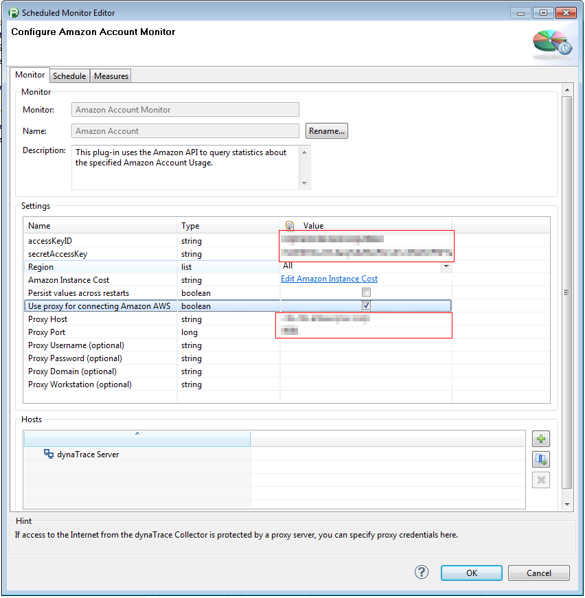
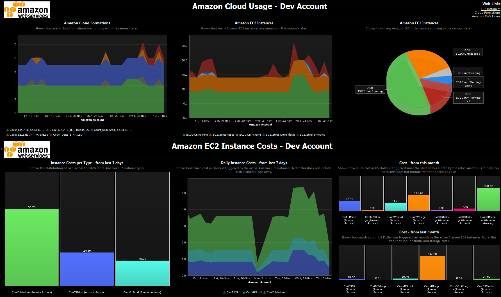
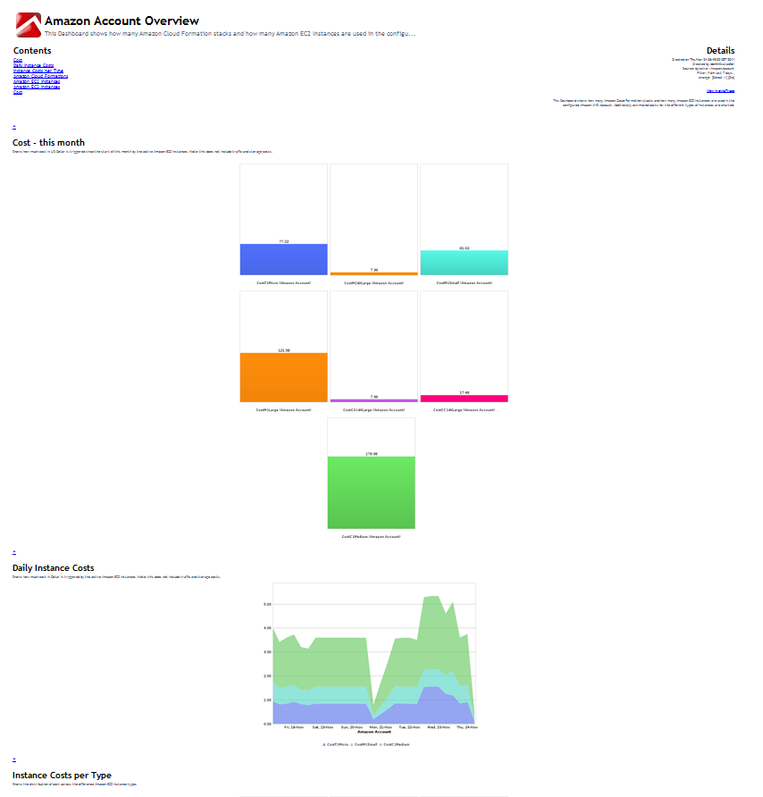

<html xmlns="http://www.w3.org/1999/xhtml">
<head>
    <title>Amazon EC2 Account Cost Monitoring FastPack</title>
    <meta http-equiv="Content-Type" content="text/html; charset=UTF-8"/>
    <meta http-equiv="X-UA-Compatible" content="IE=EmulateIE8" />
    <meta content="Scroll Wiki Publisher" name="generator"/>
    <link type="text/css" rel="stylesheet" href="css/blueprint/liquid.css" media="screen, projection"/>
    <link type="text/css" rel="stylesheet" href="css/blueprint/print.css" media="print"/>
    <link type="text/css" rel="stylesheet" href="css/content-style.css" media="screen, projection, print"/>
    <link type="text/css" rel="stylesheet" href="css/screen.css" media="screen, projection"/>
    <link type="text/css" rel="stylesheet" href="css/print.css" media="print"/>
</head>
<body>
    

        

            

                
            

            

                <h4>Amazon EC2 Account Cost Monitoring FastPack</h4>
            

        

        

            

                <h3>Table of Contents
                                        (<a href="Amazon_EC2_Account_Cost_Monitoring_FastPack.html">Start</a>)
                                    </h3>
<ul class="toc">
</ul>
            

            

                <h1>Amazon EC2 Account Cost Monitoring FastPack</h1>
    

        <h2>Overview</h2>
    

            
        The dynaTrace FastPack for Amazon EC2 Account Cost Monitoring monitors EC2 instances and CloudFormations of an Amazon AWS Account. It provides a monitor which retrieves measures for the number of instances/formations as well as cost estimations. The FastPack consists of a custom Monitor, a sample System Profile, and a dashboard.    

    

    
    

        <h2>FastPack Details</h2>
    

        <table>
<thead class=" "></thead><tfoot class=" "></tfoot><tbody class=" ">    <tr>
            <td rowspan="1" colspan="1">
        

Name    

            </td>
                <td rowspan="1" colspan="1">
        

<strong class=" ">Amazon EC2 Account Cost Monitoring FastPack</strong>    

            </td>
        </tr>
    <tr>
            <td rowspan="1" colspan="1">
        

Version    

            </td>
                <td rowspan="1" colspan="1">
        

5.5.0.5227    

            </td>
        </tr>
    <tr>
            <td rowspan="1" colspan="1">
        

dynaTrace Version    

            </td>
                <td rowspan="1" colspan="1">
        

dynaTrace 5.5 and higher    

            </td>
        </tr>
    <tr>
            <td rowspan="1" colspan="1">
        

Author    

            </td>
                <td rowspan="1" colspan="1">
        

dynaTrace software    

            </td>
        </tr>
    <tr>
            <td rowspan="1" colspan="1">
        

License    

            </td>
                <td rowspan="1" colspan="1">
        

<a href="attachments_5275722_2_dynaTraceBSD.txt">dynaTrace BSD</a>    

            </td>
        </tr>
    <tr>
            <td rowspan="1" colspan="1">
        

Support    

            </td>
                <td rowspan="1" colspan="1">
        

<a href="https://community/display/DL/Support+Levels#SupportLevels-Community">Not Supported </a>    

            </td>
        </tr>
    <tr>
            <td rowspan="1" colspan="1">
        

FastPack Contents    

            </td>
                <td rowspan="1" colspan="1">
        

<a href="attachments_174752520_1_amazonaccountmonitor_5.5.0.5227.dtp">Amazon EC2 Account Cost Monitoring FastPack</a>    

            </td>
        </tr>
</tbody>        </table>
            

    

    
    

        <h2>Description</h2>
    
    

This FastPack extends performance data collection to number of instances on Amazon EC2 and estimated cost. It    

<ul class=" "><li class=" ">    

Captures number of instances and calculates resulting cost    

</li><li class=" ">    

Provides ready made System Profile and Dashboard for visualization of results    

</li><li class=" ">    

Allows alerting on number of instances or running/daily/monthly costs    

</li><li class=" ">    

Configurable region handling and cost estimations    

</li></ul>    

To achieve this, this plugin uses the Amazon Webservices interfaces to periodically retrieve information about the number and types of EC2 instances and CloudFormations that are running in a configured Amazon AWS account and calculates related measures.    

    

    
    

        <h2>Installation</h2>
    
<ul class=" "><li class=" ">    

Download the <a href="attachments_99254374_1_amazonaccountmonitor_4.1.0.2973.dtp">plugin file</a>    

</li><li class=" ">    

On Windows, double click the file to install it in the dynaTrace Client, on Unix systems you can use &quot;Tools - Manage Plugins - Install Plugin&quot; in the dynaTrace Client    

</li><li class=" ">    

This will automatically add a System Profile &quot;AmazonAccount&quot; which contains a Montior configuration    

</li><li class=" ">    

Configure the Monitor properties via &quot;AmazonAccount - Edit System Profile - Monitors&quot; and right choose &quot;Edit&quot; on the &quot;Amazon Account&quot; entry (not &quot;Amazon Account Monitor&quot;!)    

</li><li class=" ">    

Enter values for at least accessKeyID and secretKeyID, you get these values in the Amazon AWS console under &quot;Account&quot;.    

</li><li class=" ">    

Optionally you can choose to monitor only certain regions, default is to include all Amazon regions    

</li><li class=" ">    

Instance Costs should be pre-populated, you can adjust them if Amazon changes these costs.    

</li><li class=" ">    

The setting &quot;Persist accross restarts&quot; allows to make the calculation more accurate in cases where dynaTrace is restarted or is offline for some time. This requires a temporary folder (on the machine where the related dynaTrace Collector executes) and a unique id to work properly.    

</li><li class=" ">    

The setting &quot;Use proxy for connecting Amazon AWS&quot; allows to define proxy settings when the dynaTrace Collector is running inside a corporate network with limited Internet access.    

</li></ul>    

            
            

    

    
    

        <h2>Amazon EC2 Account Cost Dashboard</h2>
    

    

    

        <table>
<thead class=" "></thead><tfoot class=" "></tfoot><tbody class=" ">    <tr>
            <td rowspan="1" colspan="1">
        

            
            

            </td>
                <td rowspan="1" colspan="1">
        

            
            

            </td>
                <td rowspan="1" colspan="1">
        

            
            

            </td>
        </tr>
    <tr>
            <td rowspan="1" colspan="1">
        

Predefined Account Monitoring Dashboard    

            </td>
                <td rowspan="1" colspan="1">
        

Report    

            </td>
                <td rowspan="1" colspan="1">
                </td>
        </tr>
</tbody>        </table>
            

    

    

        <h2>Measures</h2>
    

        <table>
<thead class=" ">    <tr>
            <td rowspan="1" colspan="1">
        

<strong class=" ">Amazon Cloud Formations</strong>    

            </td>
                <td rowspan="1" colspan="1">
        

Provides metrics about used cloud formation stacks.    

            </td>
        </tr>
</thead><tfoot class=" "></tfoot><tbody class=" ">    <tr>
            <td rowspan="1" colspan="1">
        

FormationActiveCount    

            </td>
                <td rowspan="1" colspan="1">
        

Number of cloud formation stacks that are active, i.e. CREATE_COMPLETE or any of the ..._IN_PROGRESS states.    

            </td>
        </tr>
    <tr>
            <td rowspan="1" colspan="1">
        

Count_CREATE_IN_PROGRESS    

            </td>
                <td rowspan="1" colspan="1">
        

Number of cloud formation stacks that are currently created.    

            </td>
        </tr>
    <tr>
            <td rowspan="1" colspan="1">
        

Count_CREATE_FAILED    

            </td>
                <td rowspan="1" colspan="1">
        

Number of cloud formation stacks where creation failed.    

            </td>
        </tr>
    <tr>
            <td rowspan="1" colspan="1">
        

Count_CREATE_COMPLETE    

            </td>
                <td rowspan="1" colspan="1">
        

Number of cloud formation stacks that are fully created.    

            </td>
        </tr>
    <tr>
            <td rowspan="1" colspan="1">
        

Count_ROLLBACK_IN_PROGRESS    

            </td>
                <td rowspan="1" colspan="1">
        

Number of cloud formation stacks where rollback is underway.    

            </td>
        </tr>
    <tr>
            <td rowspan="1" colspan="1">
        

Count_ROLLBACK_FAILED    

            </td>
                <td rowspan="1" colspan="1">
        

Number of cloud formation stacks where rollback failed.    

            </td>
        </tr>
    <tr>
            <td rowspan="1" colspan="1">
        

Count_ROLLBACK_COMPLETE    

            </td>
                <td rowspan="1" colspan="1">
        

Number of cloud formation stacks where rollback is done.    

            </td>
        </tr>
    <tr>
            <td rowspan="1" colspan="1">
        

Count_DELETE_IN_PROGRESS    

            </td>
                <td rowspan="1" colspan="1">
        

Number of cloud formation stacks where deleting is underway.    

            </td>
        </tr>
    <tr>
            <td rowspan="1" colspan="1">
        

Count_DELETE_FAILED    

            </td>
                <td rowspan="1" colspan="1">
        

Number of cloud formation stacks where deleting failed.    

            </td>
        </tr>
    <tr>
            <td rowspan="1" colspan="1">
        

<strong class=" ">Amazon EC2 Instances</strong>    

            </td>
                <td rowspan="1" colspan="1">
        

Provides metrics about used Amazon EC2 instances.    

            </td>
        </tr>
    <tr>
            <td rowspan="1" colspan="1">
        

EC2ActiveCount    

            </td>
                <td rowspan="1" colspan="1">
        

Number of EC2 Instances that are not terminated and not stopped.    

            </td>
        </tr>
    <tr>
            <td rowspan="1" colspan="1">
        

EC2CountStopped    

            </td>
                <td rowspan="1" colspan="1">
        

Number of EC2 Instances that are stopped.    

            </td>
        </tr>
    <tr>
            <td rowspan="1" colspan="1">
        

EC2CountPending    

            </td>
                <td rowspan="1" colspan="1">
        

Number of EC2 Instances that are currently started.    

            </td>
        </tr>
    <tr>
            <td rowspan="1" colspan="1">
        

EC2CountRunning    

            </td>
                <td rowspan="1" colspan="1">
        

Number of EC2 Instances that are running.    

            </td>
        </tr>
    <tr>
            <td rowspan="1" colspan="1">
        

EC2CountShutting-down    

            </td>
                <td rowspan="1" colspan="1">
        

Number of EC2 Instances that are currently shutting down.    

            </td>
        </tr>
    <tr>
            <td rowspan="1" colspan="1">
        

EC2CountTerminated    

            </td>
                <td rowspan="1" colspan="1">
        

Number of EC2 Instances that are terminated.    

            </td>
        </tr>
    <tr>
            <td rowspan="1" colspan="1">
        

<strong class=" ">Amazon EC2 Instance Costs</strong>    

            </td>
                <td rowspan="1" colspan="1">
        

Provides metrics for approximate costs of the currently active Amazon EC2 instances.    

            </td>
        </tr>
    <tr>
            <td rowspan="1" colspan="1">
        

CostOverall    

            </td>
                <td rowspan="1" colspan="1">
        

Cost since last invocation for currently resvered instances which are not terminated or stopped. Note that these are estimated costs as instances that are started and stopped within one hour still cause cost. Also the costs do not include additional costs for storage and transfers.    

            </td>
        </tr>
    <tr>
            <td rowspan="1" colspan="1">
        

CostM1Small    

            </td>
                <td rowspan="1" colspan="1">
        

Cost since last invocation for instances of type m1.small.    

            </td>
        </tr>
    <tr>
            <td rowspan="1" colspan="1">
        

CostM1Medium    

            </td>
                <td rowspan="1" colspan="1">
        

Cost since last invocation for instances of type m1.medium.    

            </td>
        </tr>
    <tr>
            <td rowspan="1" colspan="1">
        

CostM1Large    

            </td>
                <td rowspan="1" colspan="1">
        

Cost since last invocation for instances of type m1.large.    

            </td>
        </tr>
    <tr>
            <td rowspan="1" colspan="1">
        

CostM1XLarge    

            </td>
                <td rowspan="1" colspan="1">
        

Cost since last invocation for instances of type m1.xlarge.    

            </td>
        </tr>
    <tr>
            <td rowspan="1" colspan="1">
        

CostM3XLarge    

            </td>
                <td rowspan="1" colspan="1">
        

Cost since last invocation for instances of type m3.xlarge.    

            </td>
        </tr>
    <tr>
            <td rowspan="1" colspan="1">
        

CostM32XLarge    

            </td>
                <td rowspan="1" colspan="1">
        

Cost since last invocation for instances of type m3.2xlarge.    

            </td>
        </tr>
    <tr>
            <td rowspan="1" colspan="1">
        

CostT1Micro    

            </td>
                <td rowspan="1" colspan="1">
        

Cost since last invocation for instances of type t1.micro.    

            </td>
        </tr>
    <tr>
            <td rowspan="1" colspan="1">
        

CostM2XLarge    

            </td>
                <td rowspan="1" colspan="1">
        

Cost since last invocation for instances of type m2.xlarge.    

            </td>
        </tr>
    <tr>
            <td rowspan="1" colspan="1">
        

CostM22XLarge    

            </td>
                <td rowspan="1" colspan="1">
        

Cost since last invocation for instances of type m2.2xlarge.    

            </td>
        </tr>
    <tr>
            <td rowspan="1" colspan="1">
        

CostM24XLarge    

            </td>
                <td rowspan="1" colspan="1">
        

Cost since last invocation for instances of type m2.4xlarge.    

            </td>
        </tr>
    <tr>
            <td rowspan="1" colspan="1">
        

CostC1Medium    

            </td>
                <td rowspan="1" colspan="1">
        

Cost since last invocation for instances of type c1.medium.    

            </td>
        </tr>
    <tr>
            <td rowspan="1" colspan="1">
        

CostC1XLarge    

            </td>
                <td rowspan="1" colspan="1">
        

Cost since last invocation for instances of type c1.xlarge.    

            </td>
        </tr>
    <tr>
            <td rowspan="1" colspan="1">
        

CostCC14XLarge    

            </td>
                <td rowspan="1" colspan="1">
        

Cost since last invocation for instances of type cc1.4xlarge.    

            </td>
        </tr>
    <tr>
            <td rowspan="1" colspan="1">
        

CostCC28XLarge    

            </td>
                <td rowspan="1" colspan="1">
        

Cost since last invocation for instances of type cc2.8xlarge.    

            </td>
        </tr>
    <tr>
            <td rowspan="1" colspan="1">
        

CostCG14XLarge    

            </td>
                <td rowspan="1" colspan="1">
        

Cost since last invocation for instances of type cg1.4xlarge.    

            </td>
        </tr>
    <tr>
            <td rowspan="1" colspan="1">
        

CostHI14XLarge    

            </td>
                <td rowspan="1" colspan="1">
        

Cost since last invocation for instances of type hi1.4xlarge.    

            </td>
        </tr>
</tbody>        </table>
            

    

    
    

        <h2>New features in Version 5.5.0</h2>
    
<ul class=" "><li class=" ">    

Update Cost Values, add new Amazon AWS data center locations    

</li><li class=" ">    

Try to automatically retrieve current costs from Amazon web page, fall back to configured costs if not found or network is not available    

</li><li class=" ">    

Add some measures for costs for RDS database instances: RDSActiveCount, RDSCountByClass, RDSCostOverall, RDSCostByClass    

</li><li class=" ">    

Provide new dynamic measures to avoid having to update the plugin when amazon introduces new instance types in the future    

<ul class=" "><li class=" ">    

CostOverall by Usage, i.e. custom tag &quot;Usage&quot; on the EC2 Instance    

</li><li class=" ">    

CostOverall by Type, i.e. instance type    

</li><li class=" ">    

CostOverall by Owner, i.e. custom tag &quot;Owner&quot; on the EC2 Instance    

</li><li class=" ">    

EC2ActiveCount by Usage    

</li><li class=" ">    

EC2ActiveCount by Owner    

</li><li class=" ">    

RDSCostOverall by Status    

</li><li class=" ">    

RDSCostByClass by Instance Class    

</li><li class=" ">    

RDSActiveCount by Status    

</li><li class=" ">    

RDSActiveCountByClass by Instance Class    

</li></ul></li><li class=" ">    

Update to Amazon SDK 1.7.3    

</li></ul>    

    
    

        <h2>Known Problems/Limitations</h2>
    
<ul class=" "><li class=" ">    

As Amazon does not make the actual running costs available, the cost calculation is only an estimate, the actual values billed by Amazon might vary slightly.    

</li><li class=" ">    

The plugin only calculates cost for the EC2 instances, costs for storage, network traffic and other Amazon Services are not taken into account.    

</li></ul>    

<a href="https://community.compuwareapm.com/community/download/attachments/64192516/amazonaccountmonitor_5.5.0.5227.dtp?api=v2">amazonaccountmonitor_5.5.0.5227.dtp </a>    

    

            

        

        

            Created with <a href="http://k15t.com/display/en/Scroll-Wiki-HTML-Exporter-for-Confluence-Overview">Scroll Wiki HTML Exporter for Confluence</a>.
        

    

</body>
</html>
